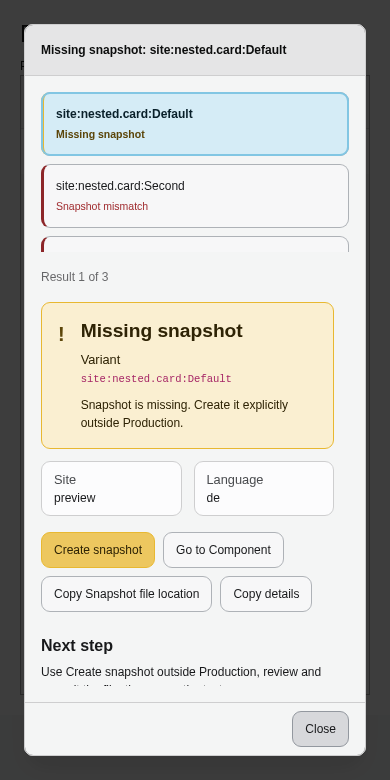
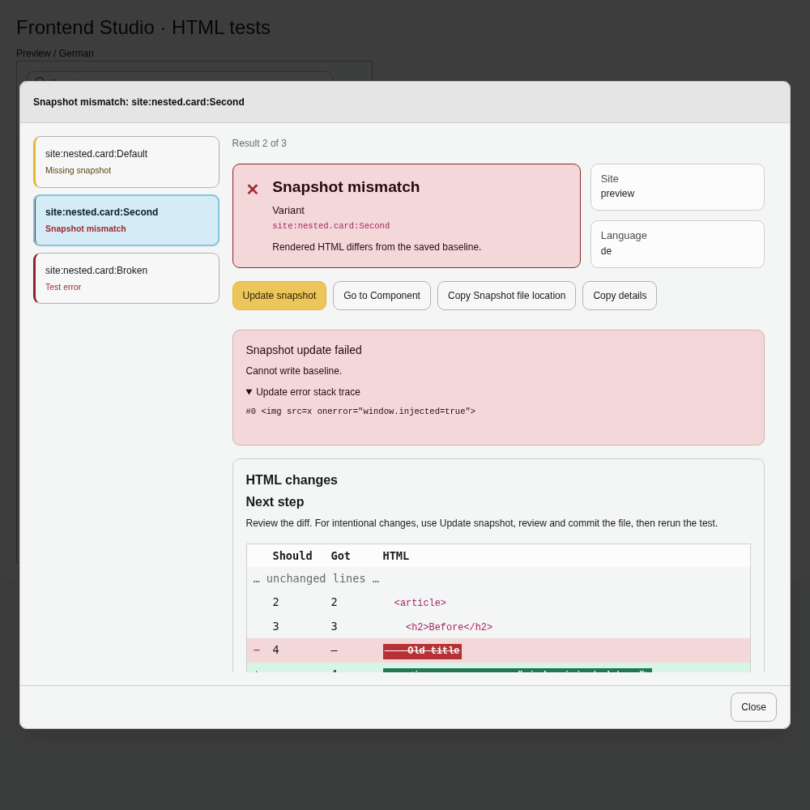
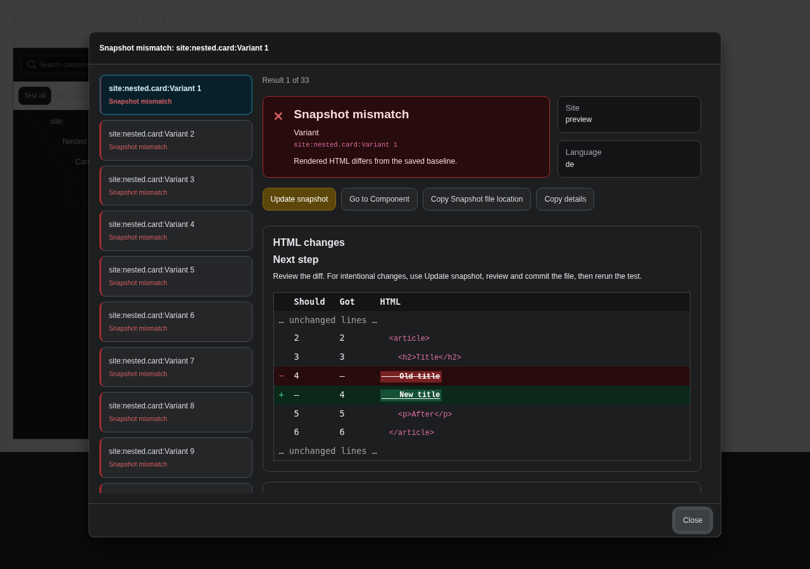

# Component Snapshots

Use Component Snapshots to check your saved Fluid component variants before committing
template changes: create your first snapshots with `vendor/bin/typo3 frontend-studio:test -u`,
review the generated HTML snapshots, and commit them alongside your templates.
Later runs show a readable diff when the HTML changes,
helping you catch unintended changes to markup, content, attributes and links
without opening every variant in the browser.

## Start snapshot testing

First, create and save representative variants in Frontend Studio.
Include the states you want to protect, such as an empty card,
a card with an image and a card with a long title.
Run the command from your installed TYPO3 project's root:

```bash
vendor/bin/typo3 frontend-studio:test
```

Omitted site and language arguments use the backend module's default selection:
the first configured site and its first enabled language.
The CLI has no HTTP host to prefer a matching site.
To select another site or language, supply their identifiers:

```bash
vendor/bin/typo3 frontend-studio:test main
vendor/bin/typo3 frontend-studio:test main en-us
```

`main` is the TYPO3 site identifier; `en-us` is the language's configured hreflang.
Providing only the site uses that site's first enabled language.
Relative site and language bases such as `/` and `/en/` are supported,
as are absolute HTTP(S) URLs. Invalid explicit identifiers fail the command.

Normal tests only compare: a missing snapshot produces a warning and its file path,
without creating a file or directory. To create the missing snapshots explicitly outside Production,
add `--update` or its shortcut `-u`:

```bash
vendor/bin/typo3 frontend-studio:test -u
```

New files appear as yellow `CREATED` results. Review their HTML and commit the files,
then rerun without `-u`. Missing snapshots and newly created files return a nonzero
exit code; a successful comparison returns `0`.

Snapshots contain the saved fixture values, slot content and fixture wrapper.
They check HTML rather than browser layout or JavaScript behavior;
use [Playwright browser tests](../Playwright/README.md) for those checks.

## Use snapshots in CI

Commit reviewed snapshots and run the same test command in CI:

```bash
vendor/bin/typo3 frontend-studio:test main en-us
```

Use the same intended site and language locally and in CI.
Each component variant has a separate snapshot for every site and language combination.
Run the command for each context you want to protect, and commit all of its snapshots.
Translated content and site-specific markup can then have different baselines.

| Exit code | Meaning |
| --- | --- |
| `0` | All comparisons pass, or an update changes no files |
| `1` | A mismatch or configuration, discovery, rendering or file error |
| `2` | Snapshots are missing, newly created or updated |
| `3` | Both errors/mismatches and missing/changed snapshots occurred |

Giving CI `-u` does not hide snapshot changes: created or updated files still fail
the job until reviewed and committed. Production and its subcontexts only compare;
they do not create missing snapshots and reject updates.

## Running HTML tests from the component tree

Backend tests require access to the Frontend Studio module. GUI testing is enabled by default.
To hide its controls and disable backend test
requests, clear **Enable GUI snapshot testing** in **Settings → Extension Configuration → frontend_studio**,
then reload the backend. CLI tests and CI remain available.

Select the preview site and language, then hover over a row to test its saved fixtures
with the ▶ button. Use **Test all** to test the complete catalog, including filtered or
collapsed rows. Unsaved form edits are not used. Requests run one variant at a time;
the toolbar shows the passed/total count. A scope receives a checkmark only after
every descendant has passed. Missing, created or updated snapshots, errors and mismatches show a
red **✕** button that opens the failure details. The toolbar's **✕ Results (N)**
button shows the number of failures and opens all their details.
Row action buttons appear on hover or keyboard focus; use the arrow keys to select a row,
then Tab to its test action and Enter to run it. Green checkmarks and red failure buttons stay visible.
Starting another run clears the previous results for that scope immediately,
including when discovery fails. Partial runs retain results and discovery errors outside their scope;
**Test all** clears all previous results.
The popup starts with a colored result summary and site/language cards,
followed by the available actions. Red identifies mismatches and errors;
yellow identifies missing, created or updated snapshots. The HTML changes section explains
the next step above the diff. Any stack trace has its own section.
When several variants fail, select one in the list to inspect its result.
The list fills the available height and scrolls independently of the details;
on small screens it sits above them.

For mismatches, the popup uses the CLI's word diff and dynamic-value masking,
showing changed sections with two HTML lines above and below each change,
when available. **Should** and **Got** show line numbers in the saved snapshot and
current output. Removed words are struck through; added words are underlined.
Expand **Show full output** to inspect the complete saved snapshot and current HTML.
HTML is displayed as escaped text.

Use **Go to Component** to open the failed variant with the current preview site
and language. Use **Copy Snapshot file location** to copy its project-relative path,
or **Copy details** to copy its message, context and output.
For an intentional mismatch, use **Update snapshot** to replace that variant's
baseline for the displayed site and language. Other snapshots stay unchanged.
For a missing snapshot, the button reads **Create snapshot**; starting a test or
opening its details does not create the file. Explicit creation applies only to
the displayed variant, site and language.
Updates use the saved fixture, including its dynamic markers, and ignore unsaved form edits.
Review and commit the changed file, then run the test again. A created or updated snapshot
stays yellow in its details and does not count as a passed test.



If creation or an update fails, its error appears separately and the original result
and any mismatch diff stay available. The action stays available for another attempt,
including after rendering or file errors.



The copy-location button is available whenever the result includes a snapshot path.
Error stack traces are visible; full output is expandable beneath the details.
Newly created snapshots still require review and a commit before another test run.
Production never creates them.
The same baseline creation and Production restrictions apply as in the CLI;
**Create snapshot** and **Update snapshot** are disabled in Production and its subcontexts.



Changing site/language or component files clears results and cancels the current
browser run. Responses from an earlier run are ignored. Manually reviewing or
recreating baseline files requires another test run; baseline writes themselves
do not trigger the development file watcher.

## Test one component or variant

Use `--scope` with an identifier from the Frontend Studio tree:

```bash
# All variants of a component
vendor/bin/typo3 frontend-studio:test main en-us --scope=c:element.text

# One variant; quote identifiers containing spaces
vendor/bin/typo3 frontend-studio:test main en-us --scope='c:element.text:Simple Test'

# All components in a folder or namespace
vendor/bin/typo3 frontend-studio:test main en-us --scope=c:element.
vendor/bin/typo3 frontend-studio:test main en-us --scope=c:
```

Replace `c` and the component names with your registered namespace and components.
Omit `--scope` to test all available fixture variants.
An unknown scope or a scope without variants fails the command.

## Review changes and update snapshots

A mismatch highlights changed words: removed text in red and added text in green,
with line numbers for the saved snapshot and current output:

```text
WARNING (MISMATCH) c:element.text:Default: Rendered HTML differs from the saved baseline.
  packages/content_element_text/Components/Element/Text/Text.fluid.html-snapshots/html-Default@main@en-us.snapshot.html
  snapshot | actual
  2 | 2  <div>
- 3 | -    <p>Hello world</p>
+ - | 3    <p>Hello TYPO3</p>
  4 | 4  </div>
```

Each changed line appears twice: `-` shows the snapshot and `+` shows the current output.
Only changed words are colored; surrounding text remains uncolored.
Only the leading signs identify changes; no extra delimiters surround words.
Without colors, compare the before and after lines to see the changed words.
Entire added or removed lines use only a leading `+` or `-` and keep their line numbers:

```text
- 3 | -  <br class="old">
+ - | 3  <hr class="new">
```

Spaces are displayed normally, including spaces inside changed text.
A `-` in a line-number column means that side has no content on that row.
Unchanged lines reserve the same space as the leading signs so the code stays aligned.
Unchanged sections are shortened so you can focus on the differences.
Dynamic values detected in the current output appear as `{{frontend-studio:dynamic}}`,
including on added lines when the HTML structure has changed.
Stable text and markup changes remain visible and still cause a mismatch.

If the change is unintended, fix your template or fixture and rerun the test.
To accept an intentional change, add `--update` or its shortcut `-u`:

```bash
vendor/bin/typo3 frontend-studio:test main en-us --scope=c:element.text -u
```

Only snapshots in the selected scope are created or updated.
Review the Git diff, commit the approved files, and rerun without `-u`.
Updates can replace manually added dynamic markers, so check those too.
An update that creates or changes files returns a nonzero exit code;
an unchanged update returns `0`.
Ordinary comparisons never write snapshot files, including when a snapshot is missing.

Warnings always show the project-relative snapshot path so you can open the affected file.
Add `-v` to also see paths for other results and exception stack traces:

```bash
vendor/bin/typo3 frontend-studio:test main en-us --scope=c:element.text -v
```

Passes are green, warnings and created or updated snapshots yellow, and errors red.
Component identifiers and variant names have separate colors.
Mismatches and missing snapshots are warnings; rendering failures are errors.
Successful comparisons show only the state, component and variant:

```text
PASSED c:atom.h1:Default
```

`Dynamic markers used.` appears only when generated or updated snapshots contain markers.

## Find and manually edit snapshot files

Snapshots live beside their component template.
For `Text.fluid.html`, variant `Default`, site `main` and language `en-us`, the file is:

```text
Text.fluid.html-snapshots/html-Default@main@en-us.snapshot.html
```

The `.snapshot.html` ending identifies snapshots while keeping them viewable as HTML
in editors and Git tools.
Snapshots and `_slots/` files do not appear as components in Frontend Studio.
Filenames include the variant, site identifier and hreflang, separated by `@`.
Special characters in each part are percent-encoded: `Simple Test` becomes
`Simple%20Test`, and `a/b` becomes `a%2Fb`.
Different templates, variants, sites and languages therefore keep independent baselines.
An update changes only the selected site, language and scope.

Generated HTML uses two spaces per nesting level, with aligned closing tags.
Layout containers such as `div`, `section` and `footer` put their text and child elements
on separate indented lines. Text elements such as `p`, headings, `span`, `strong` and `em`
only break at boundaries where the original HTML already contains whitespace.
This applies before text, before a closing tag and between inline elements:
`<p>Content</p>` stays together, while `<p> Content </p>` can use separate lines.
Spaces, tabs and line breaks allow a break; `&nbsp;` stays literal.
List items, table cells, SVG text and unknown/custom elements also preserve touching text boundaries.
When a complete formatted line exceeds 80 characters, its opening tags put every attribute on its own indented line.
The limit counts indentation, text, inline elements and closing tags, using Unicode characters rather than bytes.
The `>` or `/>` stays aligned with its opening tag; text stays attached when the original HTML has no whitespace at that boundary.
Text already on a separate line does not count towards the opening tag's line.
Long text or attribute values can still exceed the limit.
The CLI diff keeps this indentation:

```html
<!-- frontend-studio:snapshot-format:1 -->
<div class="card">
  <section>
    Before
    <h2>Title</h2>
    <p>Hello
      <strong>world</strong>!</p>
    After
  </section>
</div>
```

An attributed heading on a long line can therefore look like:

```html
<h1
  class="text-heading-3 font-bold text-text"
>A semantic H1 displayed with the H3 heading style</h1>
```

Text, entities, spaces and punctuation stay in their original order.
Original whitespace runs compare as one space, but adding or removing whitespace
around inline elements fails the test: `Hello<strong>world</strong>` differs from
`Hello <strong>world</strong>`, as does spacing between adjacent inline elements.
The generated indentation and tag line breaks do not count as original whitespace.
Existing line breaks are reused and indentation is aligned, without adding blank lines.
Intentional blank lines remain visible. Snapshots retain the exact original spaces,
tabs and line endings in an optional final whitespace comment.
Keep both the first format comment and that final comment when editing text,
attribute values or dynamic markers. To change expected whitespace or tag structure,
change the template and regenerate the snapshot with `-u`.
The contents of `pre`, `textarea`, `script` and `style` keep their exact original whitespace;
their closing tags also stay in place, even when they share the final content line.
This avoids changing preformatted text, textarea values or embedded code.
Formatting is stable: formatting an existing snapshot again produces the same result.
If an older snapshot uses different formatting, regenerate it with `-u`,
review the changes and commit the updated file.

When a value should change without failing the test,
replace only that value with `{{frontend-studio:dynamic}}`:

```html
<div id="card-{{frontend-studio:dynamic}}" class="card">
  Hello
</div>
<p>Published: {{frontend-studio:dynamic}}; status ready</p>
```

For an attribute whose entire value is dynamic, use:

```html
<div data-token="{{frontend-studio:dynamic}}" class="card">
  Hello
</div>
```

A marker accepts changing content, including an empty value,
within its attribute value or text node. It does not validate a date format or ID type.
Keep important prefixes, labels, punctuation and neighboring content outside it.
Several markers can share one value; the text between them remains checked.
Do not replace tag names, attribute names, comments or whole elements with markers.

Rerun without `-u` to verify manual edits, then commit the snapshot.
Existing markers stay as saved during ordinary comparisons.

## Dynamic values recognized automatically

Common changing dates, IDs and tokens receive automatic markers without changing
your Fluid templates. For example:

```html
<!-- Template -->
A<f:format.date date="now" format="Y-M-D H:m:s.u" />B

<!-- Snapshot -->
A{{frontend-studio:dynamic}}B
```

Automatic recognition is a convenience, so review the generated markers.
Values that remain unchanged during a run stay literal,
including fixed fixture dates. Add a manual marker when necessary.
Localized dates and unusual formats may need manual adjustment.

### Dates and times

Changing recognized dates and times are replaced as complete values,
while surrounding labels and text remain checked.

| Pattern | Examples |
| --- | --- |
| Year-first dates | `2026-10-06`, `2026/10/06`, `2026.10.06`, `2026:10:06`, `2026_10_06` |
| European and US dates | `06.10.2026`, `06/10/2026`, `10/06/2026`, `06-10-26` |
| Dates with times | `2026-10-06T14:10:01`, `2026-10-06 14:10`, `06-10-2026 14:10:01` |
| Fractions and timezones | `2026-10-06T14:10:01.123456Z`, `2026-10-06 14:10:01+02:00` |
| Alternate time separators | `2026-10-06-14-10-01`, `2026-10-06_141001_123`, `2026-10-06 14` |
| Partial dates | `2026-10`, `2026/10`, `10/2026` |
| Compact dates and timestamps | `20261006`, `261006`, `20261006T141001Z`, `20261006141001`, `261006_141001` |
| Reordered numeric dates | `14/10/01/06/10/2026`, `2026 10 6 14 10 1` |
| English named-month dates | `06 Oct 2026`, `October 6th, 2026`, `2026-Oct-06`, `October 6` |
| English weekday dates | `2026-Oct-Tue`, `Tue, 6 Oct 2026 14:10:01 GMT`, `Tue Oct 6 14:10:01 2026` |
| Standalone times | `14:10`, `14:10:01.123456`, `14:10:01,123`, `02:10:01 PM`, `59:58` |
| English date parts | `October`, `Oct`, `Tuesday`, `Tue`, `6th` |
| Timezone values | `+02:00`, `-0500`, `UTC`, `GMT`, `CEST`, `Europe/Berlin`, `America/Argentina/Buenos_Aires` |
| Clock values shaped like durations | `PT10H00M00S` |
| Unix timestamps | Integer timestamps and fractional values such as `1791288601.123456` |

Date values can include optional times, fractional seconds, AM/PM and timezones.
Date/time separators include spaces, `T`, commas, `/`, `_`, `-` and `@`.
Trailing punctuation stays checked. These patterns recognize common written forms;
they do not validate calendar dates or calculate durations.

Timezone names, leap-year flags and month lengths may remain unchanged and stay literal.
For literal `T`, `Z` or `UTC` in a PHP date format,
escape the letters as `\T`, `\Z` or `\U\T\C`.

### IDs, tokens and URL parameters

| Pattern | What receives a marker |
| --- | --- |
| UUIDs | The complete hyphenated `8-4-4-4-12` hexadecimal value or compact 32-character value |
| Numeric IDs and counters | Changing digit runs, preserving prefixes such as `card-` |
| ULIDs | The complete 26-character identifier, such as `01ARZ3NDEKTSV4RRFFQ69G5FAV` |
| Hexadecimal tokens | The complete changing hexadecimal token of at least 16 characters |
| URL parameters | The changing parameter value; the path, parameter name and other parameters stay checked |

For example, a changing URL token can produce:

```html
<a href="/path?token={{frontend-studio:dynamic}}&amp;page=1#top">Link
</a>
```

Generated TYPO3 backend route URLs use realistic synthetic tokens in snapshot output.
These change between samples, so the CLI and backend snapshot tests both save
`token={{frontend-studio:dynamic}}` and format the URLs consistently.
Normal component previews keep their original route tokens.
Regenerate older snapshots containing `token=dummyToken` with `--update` or `-u`.

The marker does not ignore additional parameters or the fragment.
Numeric matching can also mask prices or counters;
review whether those values should remain part of the test.

### Other changing values

An unrecognized changing attribute gets one marker for its entire value.
For changing text, complete changing words are marked while labels,
punctuation and neighboring words remain checked. For example,
`Token: abcXdef; status ready` and `Token: abcYdef; status ready` produce:

```html
<p>Token: {{frontend-studio:dynamic}}; status ready
</p>
```

If the result ignores too much or too little, edit the snapshot manually.
Changing HTML structure cannot be ignored with a value marker.
Keep date-dependent variants stable enough to produce the same elements and attributes.

## Current time in custom PHP code

Use TYPO3's [Context date API](https://docs.typo3.org/m/typo3/reference-coreapi/main/en-us/ApiOverview/Context/Index.html)
when a custom ViewHelper, transformer or service needs the current time.
With an injected `TYPO3\CMS\Core\Context\Context`, read:

```php
$now = $this->context->getPropertyFromAspect('date', 'full');
$timestamp = $this->context->getPropertyFromAspect('date', 'timestamp');
```

This lets snapshot tests detect changing date output without waiting.
`<f:format.date date="now" />` already uses this API and needs no changes.
Avoid `time()`, `date()` without a timestamp, or `new DateTime()` and
`new DateTimeImmutable()` without an explicit date for current-time output.
These can leave dynamic values unmarked; add manual markers if needed.
Explicit fixture dates remain supported.

## Limitations and troubleshooting

- Whitespace runs compare as one space, but whitespace presence matters:
  `a b` differs from `ab`. This also applies inside attributes, scripts,
  `pre` and `textarea`; use browser tests when exact whitespace matters.
- Snapshots check component HTML and fixture wrappers, not the preview document,
  external stylesheet contents or JavaScript behavior.
- Inline debug content is included, but its shared stylesheet is omitted.
- For a missing site or language, use the identifiers listed in the error output.
- Fix invalid fixture YAML before testing. Fixture errors can stop a scoped run
  even when the broken fixture is outside that scope.
- If changing output cannot be aligned, check for added or removed elements,
  attributes or changing multiline text. Use stable fixture values where possible.
- For unexpected rendering failures, rerun with `-v` to see the exception details.
- If a snapshot contains the old `<!-- frontend-studio:dynamic-line -->` marker,
  regenerate it with `-u` and review the result.
