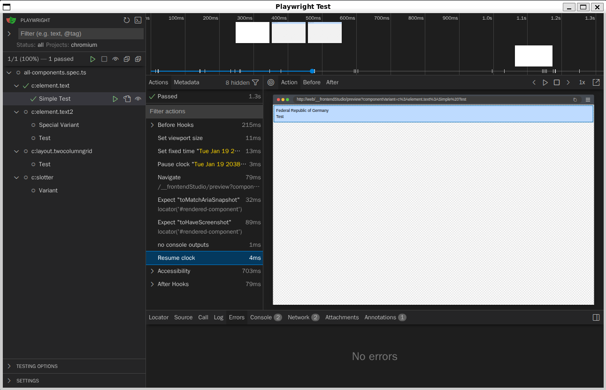

# Component browser tests with Playwright


[](https://playwright.dev/)
[](https://github.com/dequelabs/axe-core)



Fixture variants are useful examples while you build a Fluid component.
They can also protect it later: a change to a template, stylesheet,
or script may affect a variant you were not looking at.
Frontend Studio lets one Playwright spec discover and check every registered variant,
turning those examples into repeatable browser tests.

Playwright opens each rendered variant in a real browser.
A successful Fluid render alone cannot show how the component looks,
what its accessible structure is, or what the browser logs.
The supplied `snapshotTest()` compares screenshots and ARIA snapshots,
checks console output, and runs an axe accessibility scan.

Frontend Studio provides preview URLs, a variant list, and the `@frontend_studio/test` helpers.
Run Playwright from your TYPO3 project against a running site.
`fetchVariants()` finds the variants, `snapshotTest()` checks each one,
and `getUrlForVariant()` supports focused tests.
The sections below show how to set this up and review intentional changes.

## Requirements

Install Frontend Studio through Composer before adding its Playwright package.
From the TYPO3 project root, use either command.

```bash
yarn add --dev @playwright/test@^1.63.0 link:./vendor/andersundsehr/frontend_studio/Playwright
# or
npm install --save-dev @playwright/test@^1.63.0 ./vendor/andersundsehr/frontend_studio/Playwright
```

The helper uses the project's Playwright Test instance.
It installs its accessibility dependencies.
Start TYPO3 and register the component collections before running browser tests.
Set `DDEV_PRIMARY_URL` to an address the Playwright process can reach.
The examples use `http://web` inside the DDEV Playwright container.

## TypeScript and Playwright configuration

The following `playwright.config.ts` can be used as an example.
Adjust paths and the base URL for your project.
Add other browser projects if they are needed.

```ts
import { defineConfig, devices } from '@playwright/test';

export default defineConfig({
  // Search for browser tests in the component packages.
  testDir: './packages',
  // Include TypeScript specs ending in .spec.ts.
  testMatch: '**/*.spec.ts',
  // Ignore generated templates and Storybook tests.
  testIgnore: ['**/CodeTemplates/**', '**/example_extension/**'],

  // Allow tests to run in parallel.
  fullyParallel: true,
  // Reject test.only when CI is enabled.
  forbidOnly: !!process.env.CI,
  // Retry failures twice in CI; do not retry locally.
  retries: process.env.CI ? 2 : 0,
  // Use one worker in CI; use Playwright's default worker count locally.
  workers: process.env.CI ? 1 : undefined,
  // Generate an HTML report after the run.
  reporter: 'html',

  use: {
    // Set DDEV_PRIMARY_URL to a URL reachable by the runner; DDEV defaults to http://web.
    baseURL: process.env.DDEV_PRIMARY_URL || 'http://web',
    // Retain local failure traces; record a trace on the first CI retry.
    trace: process.env.CI ? 'on-first-retry' : 'retain-on-failure',
  },

  projects: [
    // Run with the Desktop Chrome device profile.
    { name: 'chromium', use: { ...devices['Desktop Chrome'] } },
    // Run with the Desktop Firefox device profile.
    // { name: 'firefox', use: { ...devices['Desktop Firefox'] } },
    // Run with the Desktop Safari device profile (WebKit).
    // { name: 'webkit', use: { ...devices['Desktop Safari'] } },
  ],
});
```

The config does not start TYPO3.
The site must be running before Playwright loads the specs.
For a host-based runner, set `DDEV_PRIMARY_URL` to a reachable site URL.

```bash
DDEV_PRIMARY_URL=https://my-project.ddev.site npx playwright test
```

## Running the tests

Run the configured suite from the project root.
For host-based runs, install the browser binaries with `npx playwright install`.

```bash
npx playwright test

# interactive mode with a browser UI:
npx playwright test --ui

# To run one component spec in Chromium, use this command:
npx playwright test packages/content_element_text/Components/Element/Text/Text.spec.ts --project=chromium
```

### Using DDEV

The [ddev-playwright add-on][ddev-playwright] from ochorocho provides a separate container.
It includes Playwright and its browser dependencies.
Install the add-on and restart DDEV.

```bash
ddev add-on get ochorocho/ddev-playwright
ddev restart
```

Run the suite or open the interactive browser UI from the project root.

```bash
ddev playwright test

# To run one component spec in Chromium, use this command:
ddev playwright test packages/content_element_text/Components/Element/Text/Text.spec.ts --project=chromium
```

> !!! Keep `PLAYWRIGHT_DOCKER_IMAGE` in `.ddev/.env.playwright` aligned with the installed Playwright version.

## Test one component variant

Keep a browser spec beside its component and name it `*.spec.ts`.
Call `getUrlForVariant()` from Node-side test code.

```ts
import { expect, test } from '@playwright/test';
import { getUrlForVariant } from '@frontend_studio/test';

test('renders the selected Text variant', async ({ page }) => {
  await page.goto(getUrlForVariant('Simple Test'));

  await expect(page.locator('#c50')).toBeVisible();
  await expect(page.locator('#c50')).toContainText('Test');
});
```

The helper returns a root-relative URL at `/__frontendStudio/preview`.
Playwright resolves it against the configured base URL's origin.

## Test every fixture variant (main feature)

`fetchVariants()` requests the variant endpoint from the supplied base URL.
It validates the response and returns the registered fixture variants.
Each entry has `url`, `componentName`, `phpNamespace`, and `variantName`.
It also has `fileName` for the snapshot path.
If `fileName` or another required value is not a string, the helper throws.
A failed request or an invalid variant list also throws.

This example `all-components.spec.ts` creates an annotated test for each variant and
groups them by component. (you only need one file like this in your project)

```ts
import { fetchVariants, snapshotTest } from '@frontend_studio/test';
import { test } from '@playwright/test';

const variants = await fetchVariants(process.env.DDEV_PRIMARY_URL || 'http://web');

for (const variant of variants) {
  test.describe(`${variant.componentName}`, () =>
    test(
      `${variant.variantName}`,
      {
        annotation: {
          type: 'component',
          description: `Component: ${variant.componentName}\nVariant: ${variant.variantName}\nFile: ${variant.fileName}`,
        },
      },
      async function ({ page }) {
        await snapshotTest(page, { variant });
      },
    ));
}
```

The fetch runs while Playwright discovers tests, before any test starts.
TYPO3 must be reachable at that time.
Each variant URL is root-relative.
The configured `baseURL` supplies its host.

## Snapshot checks and defaults

`snapshotTest()` visits the variant URL and checks one component locator.
It compares an ARIA snapshot and a screenshot.
It also checks browser console output and runs an axe accessibility scan.
The helper uses these defaults.

- The locator is `#rendered-component`.
- The viewport is 1280 by 800 pixels.
- The clock uses the date string `2038-01-19T03:14:07`.
- The accessibility tags are `wcag22aa`, `wcag22a`, `wcag21aa`,
  `wcag21a`, `wcag2aa`, `wcag2a`, and `best-practice`.
- `axeFolder` is `true`.
  An HTML report is saved for remaining accessibility violations.

Pass options beside the required `variant` to change these defaults.

```ts
await snapshotTest(page, {
  variant,
  selector: '#my-component',
  date: '2026-01-01T12:00:00Z',
  viewportSize: { width: 1440, height: 900 },
  accessibilityTags: ['wcag22aa', 'wcag22a'],
  axeFolder: false,
});
```

The default date has no timezone offset and is parsed by JavaScript.
Pass a date with an explicit offset for the same instant across environments.

## Update snapshots and ignore files

Use snapshot update mode when a reviewed change needs new baselines.
It updates the ARIA and screenshot baselines.

```bash
npx playwright test --update-snapshots
# or with DDEV
ddev playwright test --update-snapshots
```

Update mode also refreshes console and accessibility ignore files.
It records observed messages and violations without failing on them.
Review baseline and ignore-file changes before committing them.
See the [Playwright snapshot guide][playwright-snapshots] for baseline review.

The helper stores both ignore files beside the test's snapshots.
Their names end in `.consoleignore` and `.accessibilityignore`.
A console entry has the form `type➡️ message`.
An accessibility entry has the form `rule-id: node-count - description`.
The helper writes unique entries in sorted order and removes a file when empty.
It omits entries already covered by project-wide ignores.
Regeneration can remove comments from a local ignore file.

On a normal run, the helper filters messages and violations through those files.
Blank lines and lines starting with `#` are ignored.
A plain line matches the entire value exactly.
A line starting with `^` or ending with `$` is treated as a regular expression.
A remaining console message or accessibility violation fails the test.

Add project-wide ignore entries through Playwright project metadata.

```ts
projects: [
  {
    name: 'chromium',
    use: { ...devices['Desktop Chrome'] },
    metadata: {
      ignoreEntries: {
        '.consoleignore': ['debug➡️ ready'],
        '.accessibilityignore': [/^color-contrast:/],
      },
    },
  },
],
```

These entries apply to every test in that project.
Global strings follow the same exact-or-anchored-regex rule.
`RegExp` values use JavaScript pattern matching.
Local ignore files are combined with project-wide entries on normal runs.
Snapshot update mode leaves project-wide entries out of local files.

## `getUrlForVariant()` options

The helper accepts a variant name and three optional values.

```ts
getUrlForVariant(
  variantName: string,
  componentPath?: string,
  site?: string,
  language?: string,
): string
```

It builds a URL with `componentVariantName` and `componentPath` query values.
`URLSearchParams` encodes each query value.

- `variantName` is required.
  It must match a fixture variant for the component.
- `componentPath` is optional.
  When omitted, the helper infers the calling spec's absolute path.
  Pass an absolute spec path when calling through a wrapper.
  A `file:` URL such as `import.meta.url` is converted to a filesystem path.
- `site` is an optional TYPO3 site identifier.
  Without one, Frontend Studio selects an origin-matched site,
  then falls back to the first configured site.
- `language` is an optional `hreflang` value for the selected site.
  Without one, Frontend Studio uses that site's first language.

Use `undefined` for an earlier optional argument when setting a later one.

```ts
getUrlForVariant('Simple Test', undefined, 'main-site', 'de-AT');
getUrlForVariant('Simple Test', undefined, undefined, 'de-AT');
getUrlForVariant('Simple Test', import.meta.url, 'main-site', 'de-AT');
```

Unknown explicit site or language values produce a preview error.
Call the helper from Node-side test code, never from `page.evaluate()`.

[ddev-playwright]: https://github.com/ochorocho/ddev-playwright
[playwright-typescript]: https://playwright.dev/docs/test-typescript
[playwright-snapshots]: https://playwright.dev/docs/test-snapshots

## Production and live overrides

Stored fixture previews work anonymously in every application context.
Requests with `componentVariantValues` or `componentVariantSlots` require a valid TYPO3 backend session,
including fragment requests; a cookie name alone is insufficient.
Use an authenticated browser context when testing live overrides.
Production and its subcontexts allow authenticated live previews but reject fixture and slot file writes.
