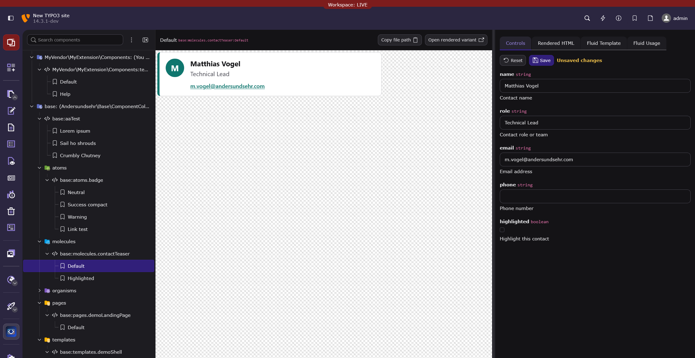

# Frontend Studio

Backend development tooling for building, testing, previewing, and documenting TYPO3 Fluid components.

Frontend Studio turns registered Fluid component collections into a TYPO3 backend frontend workshop. It helps frontend developers browse available components, preview fixture variants, adjust values through controls, inspect the rendered output, and keep useful examples close to the component templates.

## Screenshot



## Features

- Browse discovered Fluid component namespaces, folders, components, and fixture variants in a TYPO3 backend module.
- Preview selected variants in an isolated render area.
- Edit fixture values through generated controls based on component argument metadata.
- Inspect rendered HTML, Fluid template source, and generated Fluid usage snippets.
- Create, rename, delete, and save component variants where the component collection and fixture file support it.
- Download component folders as ZIP archives.
- Reload previews automatically during development when watched component template or fixture files change.

## Requirements

- TYPO3 `^14.3`
- Composer-based TYPO3 installation
- Fluid component collections registered in TYPO3 and discoverable through the Fluid component infrastructure

Frontend Studio is intended for project development workflows and should be installed as a development dependency.

## Installation

Install the extension with Composer:

```bash
composer require --dev andersundsehr/frontend_studio
```

Then flush TYPO3 caches and make sure your project registers at least one Fluid component collection.

## Quick Start

1. Open the TYPO3 backend.
2. Go to `Developer > Frontend Studio`.
3. Select a component namespace, component, and variant from the navigation tree.
4. Preview the selected variant in the main render area.
5. Use `Controls` to adjust fixture values.
6. Use the inspector tabs to review `Rendered HTML`, `Fluid Template`, and `Fluid Usage`.

The module works with component metadata provided by the registered Fluid component collection. Components without fixture variants can still appear in the tree, but variants are what make a component directly previewable and editable in the workshop.

## Component Fixtures

Frontend Studio looks for fixture files next to component templates. For a template named `ContactTeaser.html` or `ContactTeaser.fluid.html`, the sibling fixture file is:

```text
ContactTeaser.fixture.yaml
```

Fixture files use a top-level `variants` map. Each key is the variant name, and each value is a map of argument values passed to the component.

```yaml
variants:
  Default:
    name: "Matthias Vogel"
    role: "Technical Lead"
    email: "m.vogel@andersundsehr.com"
    phone: ""
    highlighted: false
  Highlighted:
    name: "Frontend Studio"
    role: "Component Workshop"
    email: "frontend@example.org"
    highlighted: true
```

## Component Slots

Declared component slots appear as HTML controls. Their trusted raw HTML is stored separately from fixture YAML next to the component template:

```text
_slots/Default__slot__default.fluid.html
```

The filename uses the variant and slot names. Runs of filesystem-invalid characters (`< > : " / \ | ? *` and control bytes) become one `-`; spaces remain unchanged.

Variant values are matched with the component argument definitions when metadata is available. Missing fixture values fall back to the argument default values shown by the component definition.

## Working With Variants

Variants are stored in the component's `.fixture.yaml` file. Depending on the selected node and available metadata, the backend module can:

- Create a new variant for a component.
- Rename an existing variant.
- Delete an existing variant.
- Save changed control values back to the fixture file.
- Download a component folder as a ZIP archive.

New variants are initialized with practical defaults for required arguments where Frontend Studio can infer them from the argument type.

## Auto Reload In Development

Frontend Studio can watch component template roots and refresh changed component previews while you work. File watching is enabled only when the TYPO3 application context is `Development` or a Development subcontext such as `Development/Local`.

```bash
TYPO3_CONTEXT=Development
```

In non-development contexts, the change stream endpoint is disabled.

## Troubleshooting

### The Module Is Empty

Check that your Fluid component collection is registered and exposes available components. Frontend Studio lists component collections that TYPO3's Fluid component infrastructure can discover.

### A Component Has No Variants

Add a sibling `.fixture.yaml` file next to the component template and include a top-level `variants` map. Components without variants can be discovered, but the workshop needs variants to render concrete examples.

### A Fixture File Shows An Error

Make sure the fixture file contains valid YAML and that the root value is a map with a `variants` key. The `variants` value must also be a map.

### Changes Do Not Auto Reload

Confirm that TYPO3 runs in `Development` context or a Development subcontext. Auto reload is intentionally disabled outside development contexts.

## Development Notes

- The backend module is registered below `Developer` as `Frontend Studio`.
- Preview rendering is handled through a dedicated preview request so the selected variant can be opened separately.
- Fixture files are written by TYPO3 when variants are created, renamed, deleted, or saved from the controls panel.
- The extension is intentionally focused on TYPO3 Fluid components and the metadata exposed by TYPO3's component APIs.

# with ♥️ from anders und sehr GmbH

> If something did not work 😮
> or you appreciate this Extension 🥰 let us know.

> We are always looking for great people to join our team!
> https://www.andersundsehr.com/karriere/
