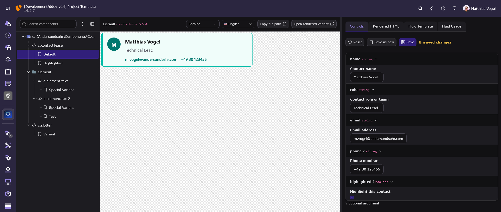
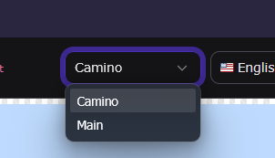
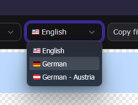

# Frontend Studio

Backend development tooling for building, testing, previewing, and documenting TYPO3 Fluid components.

Frontend Studio turns registered Fluid component collections into a TYPO3 backend frontend workshop.
It helps frontend developers:

- browse available components
- preview fixture variants
- adjust values through controls
- inspect the rendered output
- and keep useful examples close to the component templates.

## Component Snapshots

Catch unintended HTML changes locally and in CI: test your saved component variants,
review readable diffs, and commit the snapshots alongside your templates.
Run the same checks in your CI pipeline to catch regressions before merging.

**[Start snapshot testing →](Documentation/ComponentSnapshots.md)**

## Why Components?

Small, explicit components are easier to reuse, review, and test in isolation.
Variants keep realistic examples beside their component,
so frontend developers can inspect and adjust a component without rebuilding a complete page.

## Screenshot



## Features

- Browse discovered Fluid component namespaces, folders, components, and fixture variants in a TYPO3 backend module.
- Preview selected variants in an isolated render area.
- [Test component HTML locally and in CI with Component Snapshots](Documentation/ComponentSnapshots.md).
- Edit fixture values through generated controls based on component argument metadata.
- Inspect rendered HTML, Fluid template source, and generated Fluid usage snippets.
- Create, rename, delete, and save component variants where the component collection and fixture file support it.
- Download component folders as ZIP archives.
- Reload previews automatically during development when watched component template or fixture files change.

## Requirements

- TYPO3 `^14.3`
- Composer-based TYPO3 installation
- Fluid component collections registered in TYPO3 and discoverable through the Fluid component infrastructure

Frontend Studio is intended for project development workflows and should be installed as a development dependency.

## Installation

Install the extension with Composer:

```bash
composer require --dev andersundsehr/frontend_studio
```

Then flush TYPO3 caches and make sure your project registers at least one Fluid component collection.

## Quick Start

1. Open the TYPO3 backend.
2. Go to `Administration > Frontend Studio`.
3. Select a component namespace and component from the navigation tree.
4. Use `Create variant` to add a variant and enter its name.
5. Preview the variant in the main render area.
6. Use `Controls` to adjust its values, then use `Save` to persist them.
7. Use the inspector tabs to review `Rendered HTML`, `Fluid Template`, and `Fluid Usage`.

`Fluid Usage` shows separately copyable tag and inline examples using the current argument and slot controls.
Populated slots appear in the tag example; inline syntax is available when no slot is populated or only the default slot is populated.
Calls longer than 80 characters put each argument and the closing delimiter on separate lines.

### Preview site and language

When a variant is selected and the project has a configured TYPO3 site, the `Site` and `Language` selects appear to the left of `Copy file path`.
`Site` lists configured sites, and `Language` lists the languages configured for the selected site.
Changing the site keeps the current language when it is available there; otherwise, Frontend Studio selects that site's first language.

The preview, `Rendered HTML`, `Fluid Usage`, and `Open rendered variant` link update to use the selected site and language.
Unsaved values in `Controls` are preserved, and the selection is stored in the module URL so it is restored when you reload or revisit the module.





The module works with component metadata provided by the registered Fluid component collection.
Components without fixture variants can still appear in the tree.
Use `Create variant` to make one previewable and editable; Frontend Studio creates the sibling fixture file when needed.

Frontend Studio's own backend UI components are hidden from the tree by default.
Enable `Show own components` under `System > Settings > Extension Configuration` to list them under the `frontend.studio` Fluid namespace.
Each includes bundled fixture variants, so you can select one to inspect its rendered markup and source.
Their isolated previews load the TYPO3 backend stylesheet through the fixture and the component stylesheet through `<f:asset.css>`.

## Register a Component Collection

Frontend Studio discovers the Fluid component collections registered by the project.
TYPO3 14.1 and later can [register a collection declaratively](https://docs.typo3.org/c/typo3/cms-core/main/en-us/Changelog/14.1/Feature-108508-FluidComponentsIntegration.html), so most projects do not need a custom PHP class.

`Configuration/Fluid/ComponentCollections.php` registers a collection namespace and its template paths:
```php
<?php
return [
    'Vendor\\Site\\Components' => [
        'templatePaths' => [
            10 => 'EXT:site_package/Resources/Private/Components',
        ],
    ],
];
```

Register the same collection namespace as a Fluid namespace alias in `Configuration/Fluid/Namespaces.php`:

```php
<?php
return [
    'site' => [
        'Vendor\\Site\\Components',
    ],
];
```

For better IDE integration, you can add `xmlns:site="http://typo3.org/ns/Vendor/Site/Components"` to your templates.

## A Previewable Component

The following Card is available as `<site:card>`:

`Components/Card/Card.fluid.html`
```html
<f:argument name="title" type="string" />
<f:argument name="text" type="string" />

<article class="card">
    <h2>{title}</h2>
    <p>{text}</p>
    <f:slot />
</article>
```

Open `Administration > Frontend Studio`, select the `site` namespace and Card, then use `Create variant` to create `Default`.
Use `Controls` to change the values and `Save` to persist them.

Frontend Studio creates the file `Components/Card/Card.fixture.yaml`:
```yaml
variants:
  Default:
    title: "Project update"
    text: "The deployment completed successfully."
```

Use `Save as new` to create another variant.

## Component documentation

Use the **Documentation** inspector tab to write and edit component documentation, then click **Save**.
Documentation is shared by all variants and saved as Markdown next to the component template:
`Components/Card/Card.md` documents `Card.html` or `Card.fluid.html`.

Document what another frontend developer needs to use the component:

- Its purpose and when to use it.
- Usage examples, including how arguments and slots affect the result.
- Available variants and when to choose each one.
- Accessibility requirements, expected interactions, and usage limitations.

## Component Fixtures

Frontend Studio creates and updates fixture files next to component templates.
Use `Create variant`, `Controls`, and `Save` instead of manually editing them.
For a template named `ContactTeaser.html` or `ContactTeaser.fluid.html`, the sibling fixture file is:

```text
ContactTeaser.fixture.yaml
```

Fixture files use a top-level `variants` map.
Each key is the variant name, and each value is a map of argument values passed to the component.

```yaml
variants:
  Default:
    name: "Matthias Vogel"
    role: "Technical Lead"
    email: "m.vogel@andersundsehr.com"
    phone: ""
    highlighted: false
  Highlighted:
    name: "Frontend Studio"
    role: "Component Workshop"
    email: "frontend@example.org"
    highlighted: true
```

## Preview HTML wrapper

Use the optional top-level `wrapper` key to surround every variant with layout HTML:

```yaml
wrapper: |
  <section class="component-demo">
    {{component}}
  </section>
variants:
  Default:
    title: Example
```

The wrapper must be a nonempty string with exactly one `{{component}}` placeholder.
Frontend Studio inserts the rendered component HTML there without evaluating the wrapper as Fluid.
Invalid wrappers produce an error; omitting the key keeps the original output.
Full previews, fragments and Rendered HTML include the wrapper.
Fluid Usage still shows only the component invocation.

Maintain wrappers in trusted project YAML; preview HTTP parameters cannot supply them.
Variant edits preserve the wrapper and other top-level fixture metadata.
Playwright screenshots of the page include the wrapper; a locator targeting only the inner component excludes its surrounding layout.
Adjust selectors when adding a wrapper.

## Component Slots

Declared component slots appear as HTML controls.
Their trusted raw HTML is stored separately from fixture YAML next to the component template:

```text
_slots/<VariantName>__slot__<slotName>.fluid.html
```

The filename uses the variant and slot names.
Runs of filesystem-invalid characters (`< > : " / \ | ? *` and control bytes) become one `-`; spaces remain unchanged.

Variant values are matched with the component argument definitions when metadata is available.
Missing fixture values fall back to the argument default values shown by the component definition.

## Complex Arguments and Transformers

Frontend Studio derives controls from component argument types.
Scalars use native inputs, enums use selects, and `DateTime`, `DateTimeImmutable`, and `DateTimeInterface` use a local date-time input.
Built-in transformers cover `Stringable`, `Uri`, `File`, and `TypolinkParameter` arguments.

For another reusable type, add a method to an autoconfigured service.
Its typed inputs become controls and its return type must be compatible with the component argument.
Priority lets you prefer a transformer when several return types are compatible; an exact normalized return-type registration takes precedence regardless of priority:

```php
use Andersundsehr\FrontendStudio\Transformer\Attribute\TypeTransformer;
use TYPO3\CMS\Core\Http\Uri;

final readonly class ComponentTransformer
{
    #[TypeTransformer(priority: 100)]
    public function uri(string $url): Uri
    {
        return new Uri($url);
    }
}
```

### Transformer selection

An exact registration for the normalized component argument type is selected immediately, regardless of priority.
When there is no exact registration, incompatible transformers are excluded and the highest-priority transformer is selected.
Every member of a transformer return union must be assignable to at least one member of the component argument type.
At equal priority, the transformer with the highest proportion of exact type matches is selected: the number of exact matches divided by the larger union size.
If priority and specificity tie, the later-registered transformer wins.

For an argument of type `string|int|float`, a transformer returning `string|int` scores 2/3 and outranks one returning `string`, which scores 1/3, when their priorities are equal.
For an argument of type `string|Stringable`, a transformer returning `string|int` is excluded because `int` matches neither argument type.
For the same argument, an exact `Stringable` result outranks a `File` result that is only assignable through `Stringable`, when their priorities are equal.

For a transformation that only applies to one argument, create a sibling `Card.transformer.php` file.
It must return named `ArgumentTransformers` closures; container services may be typed closure parameters, while the remaining typed parameters become fixture inputs:

```php
<?php

use Andersundsehr\FrontendStudio\Transformer\ArgumentTransformers;
use TYPO3\CMS\Core\Http\Uri;
use TYPO3\CMS\Core\Resource\File;
use TYPO3\CMS\Core\Resource\ResourceFactory;
use TYPO3\CMS\Core\Type\ContextualFeedbackSeverity;

return new ArgumentTransformers(
    websocket: fn(string $url): Uri => (new Uri($url))->withScheme('wss'),
    contextIcon: fn(ContextualFeedbackSeverity $severity): string => $severity->getIconIdentifier(),
    combineUri: fn(
        string $host,
        string $path,
        string $query = '',
        string $fragment = '',
        string $scheme = 'https',
    ): Uri => new Uri($scheme . '://' . $host . '/' . $path . '?' . $query . '#' . $fragment),
    transformerWithoutArguments: fn(): Uri => new Uri('https://example.org'),
    fileWithDefault: function (ResourceFactory $resourceFactory, string $extPath = 'EXT:frontend_studio/Resources/Public/Icons/Extension.svg'): File {
        $file = $resourceFactory->retrieveFileOrFolderObject($extPath);
        assert($file instanceof File, 'The file with the path "' . $extPath . '" could not be resolved to a File object.');
        return $file;
    },
);
```

Store transformed values as a nested map under the component argument name:

```yaml
variants:
  Default:
    combineUri:
      host: "example.org"
      path: "news"
```

### Generate a missing transformer file

When Controls reports missing argument transformers, it lists every missing name and type.
Use **Create transformer starting template** to create the sibling `<Component>.transformer.php` file.
The action requires backend authentication and a protected POST request.
Generation is unavailable in Production and its subcontexts,
when the file already exists or when its directory is not writable.
Existing files are never overwritten or automatically extended.

The generated file contains an `ArgumentTransformers` entry for every missing argument.
For `stdClass`, its string input defaults to `{}` and must contain a JSON object.
Arbitrary classes, interfaces and unions receive typed TODO closures that throw an explanatory exception.
Fill in their domain logic before using the component, then reload it.
Invalid PHP types require a manually maintained transformer.
Registering a service method with `#[TypeTransformer]` is the alternative for shared type transformations.

## Working With Variants

Frontend Studio stores variants in the component's `.fixture.yaml` file.
Depending on the selected node and available metadata, the backend module can:

- Create a new variant for a component.
- Rename an existing variant.
- Delete an existing variant.
- Save changed control values back to the fixture file.
- Download a component folder as a ZIP archive.

New variants are initialized with practical defaults for required arguments
where Frontend Studio can infer them from the argument type.

## Production and preview authentication

`Production` and its subcontexts (for example `Production/Staging`) are read-only.
Creating, copying, renaming, deleting and saving variants cannot change fixture YAML or slot files.
Write controls display their restriction beside the affected action.
Stored previews and downloads remain available.
Authenticated backend users can still edit controls for a temporary live preview and reset them.

In every context, `componentVariantValues` and `componentVariantSlots` require a valid TYPO3 backend session.
Anonymous requests containing either parameter return HTTP 403,
even for empty or invalid values and for fragments or Fluid Usage.
Site and language selection and stored variant previews do not require overrides.

## Assets in Previews

The preview includes CSS and JavaScript registered while rendering the component through TYPO3's `AssetCollector`.
Declare component styles with `<f:asset.css>` in the component template.
Register JavaScript modules with `<f:asset.module>` using their configured module identifier:

```html
<f:asset.module identifier="@andersundsehr/frontend-studio/backend/variant-view.js"/>
```

The preview renders an import map including dependencies declared in `Configuration/JavaScriptModules.php`.

JavaScript modules importing `~labels/...`, directly or through dependencies,
require a valid TYPO3 backend session.
Translation requests use TYPO3's backend endpoint.
Without an authenticated session, these requests redirect to the backend login and the importing modules cannot execute.
Automated browser tests using such modules must authenticate their browser context before opening the preview.

To load additional CSS only in the standalone preview, add stylesheet paths to the top-level `stylesheets` list in the sibling fixture file.
The list applies to every variant in that fixture:

```yaml
stylesheets:
  - EXT:backend/Resources/Public/Css/backend.css
variants:
  Default: {}
```

## Auto Reload In Development

Frontend Studio can watch component template roots and refresh changed component previews while you work.
File watching is enabled only when the TYPO3 application context is `Development` or a Development subcontext such as `Development/Local`.

```bash
TYPO3_CONTEXT=Development
```

In non-development contexts, the change stream endpoint is disabled.

### Limitations

Preview rendering compiles the selected site's TypoScript sets and the site's `config/sites/<site>/setup.typoscript` and `constants.typoscript` files.
It does not compile TypoScript from `sys_template` records, load a `pages` record, or build a rootline.
The configured root page ID is passed internally to TYPO3's condition matcher, but it is not exposed as a TypoScript condition variable.
The condition inputs `page`, `fullRootLine`, and `localRootLine` are empty, so conditions such as `tree.rootLineIds` see no page hierarchy.
Site sets and site-level TypoScript can still define a `PAGE` object, but no page record or rootline data is available to it.

## Troubleshooting

### The Module Is Empty

Check that your Fluid component collection is registered and exposes available components.
Frontend Studio lists component collections that TYPO3's Fluid component infrastructure can discover.

### A Component Has No Variants

Select the component and use `Create variant` to add one.
Frontend Studio creates the sibling fixture file when it does not exist.

### A Fixture File Shows An Error

Make sure the fixture file contains valid YAML and that the root value is a map with a `variants` key.
The `variants` value must also be a map.

### Changes Do Not Auto Reload

Confirm that TYPO3 runs in `Development` context or a Development subcontext.
Auto reload is intentionally disabled outside development contexts.

## Further Reading

- [Component browser tests with Playwright](Playwright/README.md).
- [Fluid components](https://docs.typo3.org/m/typo3/reference-coreapi/main/en-us/ApiOverview/Fluid/UsingFluidInTypo3.html)
- [ViewHelper `f:argument`](https://docs.typo3.org/other/typo3/view-helper-reference/main/en-us/Global/Argument.html)
- [ViewHelper `f:slot`](https://docs.typo3.org/other/typo3/view-helper-reference/main/en-us/Global/Slot.html)

## Development Notes

- The backend module is registered below `Developer` as `Frontend Studio`.
- Preview rendering is handled through a dedicated preview request so the selected variant can be opened separately.
- Fixture files are written by TYPO3 when variants are created, renamed, deleted, or saved from the controls panel.
- The extension is intentionally focused on TYPO3 Fluid components and the metadata exposed by TYPO3's component APIs.

## Contributor Checks

The test runner uses Docker or Podman.
Run the checks with each supported PHP version (`8.4` and `8.5`); the CI setup covers GrumPHP, unit tests, and functional tests with MySQL, MariaDB, and PostgreSQL:

```bash
./Build/Scripts/runTests.sh -p 8.5 -s composerUpdate
./Build/Scripts/runTests.sh -p 8.5 -s grumphpRun
./Build/Scripts/runTests.sh -p 8.5 -s unit
./Build/Scripts/runTests.sh -p 8.5 -s functional -d mysql
./Build/Scripts/runTests.sh -p 8.5 -s functional -d mariadb
./Build/Scripts/runTests.sh -p 8.5 -s functional -d postgres
./Build/Scripts/runTests.sh -s javascript
./Build/Scripts/runTests.sh -s javascriptBuildCheck
```

For JavaScript tests and CI checks, see [test placement and commands](Tests/browser/README.md).
For dependency updates and bundle builds, see [the build guide](Build/InlineDocumentationEditor/README.md).

## License and Author

Frontend Studio is licensed under [GPL-2.0-or-later](LICENSE).
The package author is Matthias Vogel (`m.vogel@andersundsehr.com`).

# with ♥️ from anders und sehr GmbH

> If something did not work 😮
> or you appreciate this Extension 🥰 let us know.

> We are always looking for great people to join our team!
> https://www.andersundsehr.com/karriere/
